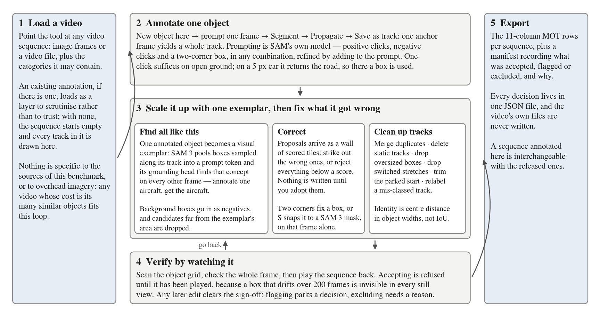
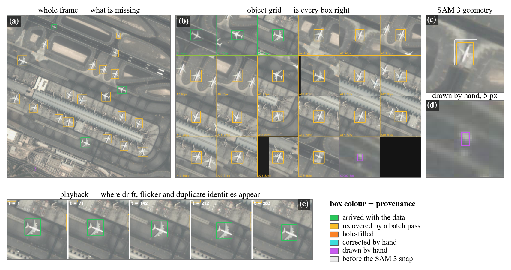

# An open annotation tool for tracking

What limits tracking in spaceborne video is annotated data, not model capacity,
and annotating video by hand does not scale. This is the tool that produced this
benchmark's multi-object ground truth, released so that tracking data for small,
numerous objects can keep growing past the sources collected here.

**Point it at a video nothing has ever labelled, and it returns tracking ground
truth — from a handful of prompted frames rather than a box on every frame.**



*Annotating a new video, end to end. Step 2 is a prompt on a single frame, which
SAM 3 carries through the rest of the video as a track. Step 3 turns that one
annotated object into a visual exemplar and sweeps the sequence for every other
instance of it — which is what makes a scene of hundreds of similar objects
affordable. Nothing the sweep proposes is written until you adopt it.*

## What it takes and what it returns

Point it at a sequence of image frames or a video file, together with the
categories that sequence may contain. Nothing else is required, and in
particular nothing about the datasets assembled in this benchmark. Where an
annotation already exists it is loaded as a layer to be scrutinised rather than
trusted; where none exists the sequence starts empty and every track in it will
be drawn in the tool.

What comes back is the row format Space-Tracker-MOT ships, so a newly annotated
video is interchangeable with the released ones and is evaluated by the same
code.

```bash
export SPACE_TRACKER_ROOT=/path/to/space_tracker   # a released sequence to open
CUDA_VISIBLE_DEVICES=0 python -m annotation_tool.app
```

Needs `gradio` and SAM 3. `--port` moves the server, `--sequences ID …` opens
named sequences, `--datasets` and `--modes` narrow the work list. Decisions are
written to `review.json` (`$SPACE_TRACKER_REVIEW`); neither the released package
nor any source data is ever written to.

## A few prompts, a whole video

Prompting follows SAM's own interaction model: positive clicks assert that a
pixel belongs to the object, negative clicks push the mask off a wake, a shadow
or a neighbour it has leaked into, and two clicks marking opposite corners give
a box. All three combine in one prompt, so a mask that comes back wrong is
refined by adding to the prompt rather than by starting again.

`New object here` → click two opposite corners → `Segment` → `Propagate` →
`Save as track`. The canvas zooms 8× onto the last click, because the objects
this is built for are a handful of pixels across.

Which prompt is the right one is a property of the object, not a preference. One
positive click is enough for a vessel or an aircraft against uniform ground; on
a 5 px car it returns the road the car stands on more often than the car, and
there a box around the object recovers the same cars to within a pixel.

The accepted mask's tight axis-aligned box is then propagated through the
sequence, so **one anchor frame per object is usually the whole cost of a
track**. Propagation runs forward only, from the frame the object was actually
seen on — a backward pass would fill frames you have not looked at with boxes on
whatever the tracker latched onto, and afterwards those are indistinguishable
from real ones (`also track backwards` opts in). It reports the frame at which
it stopped instead of trailing off silently.

## One exemplar, every instance of the same thing

What makes this data expensive is not the difficulty of any single object but
their number: a spaceborne scene is an apron with forty aircraft or a road with
two hundred cars, and drafting them one at a time is why so many are still
unlabelled.

SAM 3 accepts a **visual exemplar** in place of a text prompt — its geometry
encoder pools a box over an image's features into a prompt token, and its
grounding head finds that concept on any other image. `🔍 Find all like this`
exposes this as a first-class operation: one object you have already annotated
becomes the query, boxes sampled along its track are pooled into an exemplar
bank, the sequence is swept, and every other object that looks like it comes
back as a candidate. **Annotating one aircraft returns the aircraft, not an
aircraft.**

Two things keep the sweep honest. Background boxes from the same sequence are
pooled in with a negative label, which stops the prototype collapsing onto "any
small bright blob" — the characteristic failure on overhead imagery, where roof
furniture and road markings read like vehicles. And a candidate whose area is far
from the exemplar's is rejected on geometry alone, because in an aircraft scene
the strongest visual match to a car-shaped prompt is often an aircraft. Frames
are sampled rather than swept exhaustively, which costs less and additionally
finds objects that enter the video late, as prompting a single frame does not.

## Nothing the model proposes is committed

A model prompted this way will also be confidently wrong, so the sweep writes
nothing. Its output is a wall of candidate crops, each labelled with the frame it
came from and its score, and led by the exemplar itself — every score on the wall
is a claim about similarity *to that crop*, and judging the claims without seeing
what they resemble is guesswork. Strike out wrong candidates by clicking them,
reject everything below a score in one action, and only then adopt the rest, at
which point each survivor is propagated into its own track.

What follows is ordinary correction. A track whose class is wrong is relabelled
rather than deleted and redrawn; a track that should not exist is deleted; a mask
that leaks is pushed off with a negative click; an existing box is snapped to a
fresh SAM 3 mask with `S`; and a box that drifts on one frame is corrected on
that frame alone — repairing frame 41 of a 283-frame track leaves the other 282
exactly as they were.

Five cleanup passes then remove what propagation and bulk adoption introduce:

| | catches |
|---|---|
| `Merge duplicate tracks` | one object under two ids, and a track that resumes another after a propagation break |
| `Delete static tracks` | objects that never move, in either coordinate frame |
| `Drop oversized boxes` | frames where the mask leaked onto the surroundings |
| `Drop stretches that switched object` | a track that left its object for another mid-sequence |
| `Trim the parked start` | a vehicle parked for the first N frames, then driving |

Each reports what it changed, and each deletes only frames the tool itself
produced. Their decisions are taken on **centre distance measured in object
widths rather than on IoU**, because at this scale a one-pixel offset in each
axis already takes IoU on a 5.5 px box to 0.50. On one sequence the true
same-object pairs sat at 0.14–0.98 widths and the next 745 pairs began at 6.8,
while IoU put those same true pairs at 0.30–0.57, indistinguishable from the
rest.

## Three surfaces, because no single one exposes every error



*Every panel is rendered by the tool's own code. **(a)** The whole frame is
navigation, and the only view in which an object carrying no annotation yet
announces itself. **(b)** The object grid crops every object of the current frame
to its own box and upscales all crops to one tile size, so objects spanning
4.9–82.8 px become comparable and a wrong box is visible in one pass. **(c)** A
box before and after it was snapped to a SAM 3 mask. **(d)** A car drawn by hand
at 4.9 px, at the same tile zoom as the aircraft: this is the scale the tool has
to make clickable. **(e)** Playback, where drift, flicker and duplicate
identities appear and no still view does. Box colour is provenance, not class.*

One frame here holds objects differing in scale by more than an order of
magnitude, and at the resolution a browser can show, a 5 px car is a dot.
Inspection therefore cannot happen on the frame. The grid is the only view in
which a wrong box is obvious rather than sub-pixel; the whole frame answers the
question the grid cannot, since an object carrying no annotation has no tile; and
playback is kept for the questions no still view contains at all — drift, flicker
and two identities on one object are relations *between* frames, and a per-object
crop removes exactly that relation.

Across all three, box colour encodes **provenance rather than class**, so a box a
model propagated, a box a user corrected and a box that arrived with the data are
never confused for one another.

`←` `→` frame (`shift` for ±10) · `[` `]` sequence · `S` snap the selected box ·
`U` undo this frame's correction · `P` play · `A` accept · `F` flag · `X` exclude.

## Verification is watching the video

A sequence is signed off as a whole, and only once it has been played back: a box
that drifts over 200 frames is invisible in every still view, so `A` is refused
until the sequence has actually been watched (`--no-watch-required` turns the
check off), and any later edit clears both the acceptance and the record of
having watched it — a sign-off always refers to the annotation that was actually
played.

| | key | meaning | export |
|---|---|---|---|
| ✅ accept | `A` | ships | in |
| ⚑ flag | `F` | parked, a decision is owed | in, marked `flagged` |
| ✖ exclude | `X` | dropped, and a written reason is required | out, audited in `excluded.json` |

All three verdicts are exported, so **a set annotated with this tool arrives with
its own audit trail** rather than merely looking clean. Tags (`static`,
`single_object`, `fast_motion`, `occlusion`, `tiny`, …) say what a sequence *is*
and deliberately touch neither the verdict nor the watched flag: "everything in
it is static" is a property of the imagery, not a claim that anyone inspected it.

## Not only for spaceborne video

Nothing in the loop is specific to overhead imagery. SAM 3 is a general model,
the exemplar sweep asks only that instances of a class resemble one another, and
the defaults — a per-object zoom, a size gate, thresholds chosen for objects a
few pixels across — are settings rather than assumptions.

Any video whose annotation cost is dominated by the sheer number of similar
objects should be annotated with it, and we would encourage that. The spaceborne
case is where we needed it first, not the limit of where it applies.

## Files

```
app.py                 Gradio UI, navigation, hotkeys
core/annotate.py       click-to-segment annotation
core/exemplar.py       sweep a sequence for objects resembling the draft
core/sam3refine.py     SAM 3 box refinement and propagation
core/merge.py          duplicates, continuations, contaminated stretches
core/motion.py         parked / pinned detection, motion onset
core/sizecheck.py      boxes that departed from a track's own size
core/gtsource.py       the ground truth in view, with per-box provenance
core/paths.py          sequences, frames and ground-truth paths
core/vqueue.py         the work list
core/vdecisions.py     per-sequence corrections and sign-off, one JSON
core/vrender.py        grid / frame / fix views
core/video.py          whole-sequence playback
core/tracks.py         track-level reads shared by the above
export.py              one CSV per sequence, plus the manifest of verdicts
```

The app holds `review.json` in memory and rewrites it on every action, so **never
edit that file while the server is up** — the next click puts the in-memory copy
back. Stop the process first, or work on a copy. Launched detached
(`setsid nohup … & disown`) it survives the session that started it.

---

Every sequence of Space-Tracker-MOT passed through this tool, which is where its
+1,256 tracks and +256,969 boxes came from. That is a demonstration of the tool
at scale, not its purpose.
