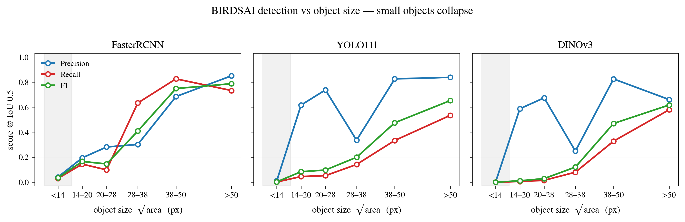

# BIRDSAI 检测任务对比 — 3 检测器 vs SAM3 (train-exemplar)

> **数据集**: BIRDSAI (热成像航拍野生动物), test split
> **GT**: `annotations_sam3` (SAM3 框精修的紧框)
> **协议**: 同一批 **15,494 帧** · IoU = 0.5 · fine 5-class · 检测器工作点 score ≥ 0.5
> **方法**: FasterRCNN / YOLO11l / DINOv3 (监督检测器) vs **SAM3 train-exemplar** (单样本跨图 exemplar grounding,无 test GT,fair)

---

## 表 1 · 总体检测指标

| 方法 | Precision | Recall | F1 | mAP@0.5 |
|---|---:|---:|---:|---:|
| FasterRCNN | 0.465 | 0.452 | **0.459** | 0.139 |
| YOLO11l | 0.772 | 0.234 | 0.359 | 0.101 |
| DINOv3 | 0.666 | 0.228 | 0.340 | 0.077 |
| **SAM3-xexemplar** | 0.195 | **0.581** | 0.292 | —¹ |

¹ SAM3-xexemplar 输出框分数恒为 1.0,无法排序 → mAP 不适用,只在单工作点比 P/R/F1。

---

## 表 2 · 每类 F1 (IoU 0.5)

| 类别 | nGT | FasterRCNN | YOLO11l | DINOv3 | **SAM3-xexemplar** |
|---|---:|---:|---:|---:|---:|
| human | 21,853 | **0.164** | 0.109 | 0.025 | 0.128 |
| elephant | 48,055 | **0.673** | 0.496 | 0.474 | 0.565 |
| giraffe | 3,231 | 0.022 | 0.032 | 0.000 | **0.474** |
| lion | 351 | 0.000 | 0.000 | 0.000 | **0.176** |
| unknown | 5,271 | 0.018 | 0.001 | 0.000 | **0.057** |
| **OVERALL** | 78,761 | **0.459** | 0.359 | 0.340 | 0.292 |

> 加粗 = 该类最高分。检测器的总体优势几乎全部来自 elephant(占 GT 61%);稀有小目标 giraffe / lion / unknown 检测器≈0,只有 SAM3-xexemplar 能召回。

---

## 表 3 · 每类 mAP@0.5（仅检测器，score-ranked）

| 类别 | nGT | FasterRCNN | YOLO11l | DINOv3 |
|---|---:|---:|---:|---:|
| human | 21,853 | 0.044 | 0.084 | 0.026 |
| elephant | 48,055 | **0.649** | 0.400 | 0.355 |
| giraffe | 3,231 | 0.001 | 0.020 | 0.001 |
| lion | 351 | 0.000 | 0.000 | 0.000 |
| unknown | 5,271 | 0.002 | 0.000 | 0.002 |
| **mean mAP** | — | **0.139** | 0.101 | 0.077 |

---

## 表 4 · 每类 Precision / Recall (IoU 0.5)

| 方法 | 类别 | P | R | F1 |
|---|---|---:|---:|---:|
| **FasterRCNN** | human | 0.189 | 0.144 | 0.164 |
| | elephant | 0.674 | 0.672 | 0.673 |
| | giraffe | 0.022 | 0.022 | 0.022 |
| | lion | 0.000 | 0.000 | 0.000 |
| | unknown | 0.015 | 0.022 | 0.018 |
| **YOLO11l** | human | 0.551 | 0.061 | 0.109 |
| | elephant | 0.820 | 0.355 | 0.496 |
| | giraffe | 0.788 | 0.016 | 0.032 |
| | lion | 0.000 | 0.000 | 0.000 |
| | unknown | 0.009 | 0.001 | 0.001 |
| **DINOv3** | human | 0.753 | 0.013 | 0.025 |
| | elephant | 0.665 | 0.368 | 0.474 |
| | giraffe | 0.000 | 0.000 | 0.000 |
| | lion | 0.000 | 0.000 | 0.000 |
| | unknown | 0.000 | 0.000 | 0.000 |
| **SAM3-xexemplar** | human | 0.080 | 0.314 | 0.128 |
| | elephant | 0.463 | 0.724 | 0.565 |
| | giraffe | 0.419 | 0.546 | 0.474 |
| | lion | 0.099 | 0.792 | 0.176 |
| | unknown | 0.031 | 0.393 | 0.057 |

---

## 图 1 · 检测表现 vs 物体大小（小目标急剧下降）

> 三个检测器,横轴 = 物体尺寸 √area(px,6 个数据驱动分桶),纵轴 = score@IoU0.5,
> 彩色线 = Precision / Recall / F1。灰色阴影 = 最小目标区(<14px)。
> **趋势**: 三个模型在最小桶全部塌到 ≈0,随尺寸增大急剧回升 → 性能几乎完全由物体大小决定。
> FasterRCNN 在中等尺寸已起来(28–38px 桶 R=0.63),YOLO/DINOv3 要到 >38px 才有召回。

| √area (px) | nGT | FasterRCNN F1 | YOLO11l F1 | DINOv3 F1 |
|---|---:|---:|---:|---:|
| <14 | 10,599 | 0.034 | 0.002 | 0.000 |
| 14–20 | 12,147 | 0.165 | 0.083 | 0.010 |
| 20–28 | 13,793 | 0.145 | 0.096 | 0.028 |
| 28–38 | 4,223 | 0.408 | 0.199 | 0.120 |
| 38–50 | 18,414 | 0.748 | 0.475 | 0.469 |
| >50 | 19,585 | 0.787 | 0.652 | 0.616 |

---

## 结论（PPT 讲点）

1. **总体 F1 检测器领先,但靠的是大象**。elephant 占 GT 61%,三个检测器只有大象 + (FasterRCNN 的) 人能打;一换成稀有小目标就全面崩到 0。
2. **SAM3 train-exemplar 的价值在长尾**:giraffe 0.474 / lion 0.176 / unknown 0.057——这三类正是检测器的盲区(≈0)。单样本 exemplar 把它们从 0 救回来。
3. **两类方法工作点性格相反**:监督检测器 = 高精度低召回(YOLO P 0.77 / R 0.23),漏检严重;SAM3-x = 高召回低精度(R 0.58 / P 0.20),FP 多。
4. **mAP 排序在紧框 GT 下反转**:FasterRCNN 0.139 > YOLO 0.101 > DINOv3 0.077(原 `annotations` 上 DINOv3 最高);SAM3 紧框抬高 IoU 门槛,松框检测器(DINOv3)最吃亏。

---

*生成脚本: `evaluation/_birdsai_detection_compare.py`（纯离线打分,复用缓存 predictions.json,无 GPU/重推理）。一致性校验: SAM3-xexemplar OVERALL F1 = 0.292 与原 eval 完全一致。*
