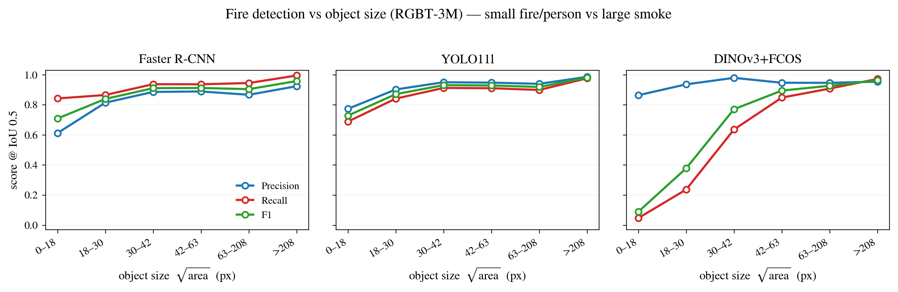

# Fire Detection Comparison on RGBT-3M (FireRGBT)

Use case: **wildfire detection** (detection-only, no tracking).
Dataset `FireRGBT` (RGBT-3M) · fine 3-class {smoke, fire, person} · all images 640×480.
Identical train/val/test splits and transforms across all three models (apples-to-apples).
Test set = 3,366 frames · IoU = 0.5 · fine 3-class.

**Unified operating point.** All Precision / Recall / F1 numbers below are recomputed
from a single per-frame prediction dump at **score ≥ 0.5**, IoU ≥ 0.5, with
**class-aware** greedy (highest-IoU-first) matching. The **overall** row is the
**micro-average** (sum of per-class TP/FP/FN), so it necessarily lies within the
per-class range — identical methodology to the BIRDSAI detection table
(`evaluation/_fire_detection_compare.py`, mirroring `_birdsai_detection_compare.py`).

> **Why this replaces the earlier table.** The previous "overall" Precision came
> from each model's training-time `test/Precision`, which for FasterRCNN and
> DINOv3 was a **class-agnostic** count over **all** raw detections down to
> torchvision's default `score_thresh=0.05`. That flooded the FP count with
> low-confidence boxes and pushed overall precision *below every per-class
> precision* (FasterRCNN 0.709 < 0.85–0.88), a caliber mismatch. Everything here
> is now on one 0.5 footing. (YOLO11l was already evaluated at its own operating
> point, so its numbers barely move.)

mAP@0.5 = VOC all-point, score-ranked (threshold-independent); reported from each
model's official test run, not recomputed at the operating point.

Three detector paradigms:

| Method | Paradigm | Backbone | Trainable |
|---|---|---|---:|
| **Faster R-CNN** | fine-tuned two-stage | R50-FPN | 41.3 M |
| **YOLO11l** | fine-tuned one-stage | YOLO11l (manual-loop trained) | ~25 M |
| **DINOv3+FCOS** | frozen foundation features + dense head | DINOv3 ViT-B/16 (frozen) | 4.9 M head / 90.6 M total |

## Per-class AP@0.5

| Class | Faster R-CNN | YOLO11l | DINOv3+FCOS |
|---|---:|---:|---:|
| smoke | **0.950** | 0.929 | 0.932 |
| fire | **0.883** | 0.849 | 0.661 |
| person | **0.876** | 0.873 | 0.701 |
| **mAP** | **0.903** | 0.884 | 0.765 |

## Overall detection metrics (unified score ≥ 0.5, micro-average)

| Method | Precision | Recall | F1 | mAP@0.5 |
|---|---:|---:|---:|---:|
| Faster R-CNN | 0.823 | 0.920 | 0.869 | **0.903** |
| YOLO11l | 0.920 | 0.871 | 0.895 | 0.884 |
| DINOv3+FCOS | 0.952 | 0.608 | 0.742 | 0.765 |

Each overall P/R now lies inside its own per-class range below (micro-average),
so it is directly comparable to the per-class rows and to the BIRDSAI table.

## Per-class detection P / R / F1 (score ≥ 0.5)

### Faster R-CNN
| Class | nGT | P | R | F1 |
|---|---:|---:|---:|---:|
| smoke | 4086 | 0.873 | 0.947 | 0.908 |
| fire | 3401 | 0.779 | 0.892 | 0.832 |
| person | 1740 | 0.797 | 0.912 | 0.851 |

### YOLO11l
| Class | nGT | P | R | F1 |
|---|---:|---:|---:|---:|
| smoke | 4086 | 0.946 | 0.903 | 0.924 |
| fire | 3401 | 0.902 | 0.834 | 0.867 |
| person | 1740 | 0.896 | 0.868 | 0.881 |

### DINOv3+FCOS
| Class | nGT | P | R | F1 |
|---|---:|---:|---:|---:|
| smoke | 4086 | 0.965 | 0.804 | 0.877 |
| fire | 3401 | 0.930 | 0.438 | 0.596 |
| person | 1740 | 0.946 | 0.479 | 0.636 |

## Detection by object size (small vs large, COCO area split)

Split at COCO small threshold (area < 32×32 = 1024 px², in the 640² eval space):
small nGT = 3369, large nGT = 5858. The "frozen foundation features collapse on
tiny objects" finding — frozen stride-16 DINOv3 features keep precision but lose
almost all recall on small fire/person, while the fine-tuned detectors hold up.

| Method | size | P | R | F1 |
|---|---|---:|---:|---:|
| Faster R-CNN | small | 0.717 | 0.863 | 0.783 |
| Faster R-CNN | large | 0.891 | 0.953 | 0.921 |
| YOLO11l | small | 0.856 | 0.779 | 0.816 |
| YOLO11l | large | 0.955 | 0.924 | 0.939 |
| DINOv3+FCOS | small | 0.948 | **0.178** | 0.299 |
| DINOv3+FCOS | large | 0.953 | 0.855 | 0.901 |

## Efficiency

| Method | Params | GFLOPs | FPS | Model MB |
|---|---:|---:|---:|---:|
| Faster R-CNN | 41.3 M | 181.7 | 97.6 | 158.0 |
| DINOv3+FCOS | 90.6 M | 385.3 | 117.0 | 345.6 |

(YOLO11l efficiency not captured in its manual-loop `test_metrics.json`.)

## Takeaways

- **Fine-tuned detectors win**: Faster R-CNN (0.903) ≈ YOLO11l (0.884) ≫ frozen
  DINOv3+FCOS (0.765) on mAP; on operating-point F1 the same order holds
  (0.869 / 0.895 / 0.742).
- **Frozen DINOv3 matches on large/easy smoke** (0.93, on par with both fine-tuned
  detectors) but **lags badly on small fire/person** (~29 px median): per-class AP
  0.66 / 0.70 vs Faster R-CNN's 0.88 / 0.88.
- The size split makes the mechanism explicit: frozen DINOv3 small-object **recall
  collapses to 0.178** (vs Faster R-CNN 0.863) at near-perfect precision (0.948) —
  frozen stride-16 features can localise big objects but miss tiny ones. This is
  the "frozen foundation features vs fine-tuned task-specific detector" result.
- **DINOv3 trades recall for precision at 0.5**: its overall precision (0.952) is
  the highest of the three, but recall (0.608) is far below the fine-tuned
  detectors — it only fires on confident, mostly-large objects.

## Figure — performance vs object size

Per-frame predictions were re-dumped (`evaluation/eval_fire_detect_dump.py`) and
re-binned by GT object size (sqrt-area, 640² eval space, 6 quantile bins ≈ 1538
boxes each). One panel per detector; lines = Precision / Recall / F1 at IoU 0.5,
score ≥ 0.5. Built by `tools/plot_fire_size_trend.py`
(→ `figures/fire_size_trend.{png,pdf,csv}`). Same layout as the BIRDSAI
size-trend plot.

Reading: **Faster R-CNN** and **YOLO11l** stay flat-high across all sizes (only a
mild dip at the smallest <18 px bin, F1 ≈ 0.71 / 0.73). **DINOv3+FCOS** keeps high
**precision** everywhere but its **recall collapses on small objects** — R = 0.05
at <18 px and 0.24 at 18–30 px, only recovering above ~42 px. The frozen stride-16
foundation features localise large smoke as well as the fine-tuned detectors but
miss tiny fire/person — exactly the per-size mechanism behind the 0.765 vs
0.90/0.88 overall mAP gap.

## Sources

All operating-point P/R/F1 recomputed at score ≥ 0.5 by
`evaluation/_fire_detection_compare.py` from the unified per-frame dump
`/work/ziwen/experiments/fire_detect_dump/fire_detect_predictions.json`
(produced by `evaluation/eval_fire_detect_dump.py`, all three models, boxes kept
down to score 0.05). mAP@0.5 and per-class AP are from each model's official
test run:

- Faster R-CNN: `/work/ziwen/experiments/fasterrcnn_fire_20260525_202026/test_metrics.json`
- YOLO11l: `/work/ziwen/experiments/yolo11l_fire_manual_20260611_161635/test_metrics.json`
- DINOv3+FCOS: `/work/ziwen/experiments/dinov3_vitb16_fire_20260612_122759/test_metrics.json`
